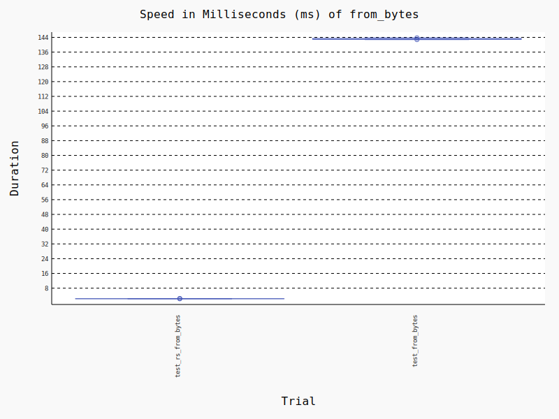
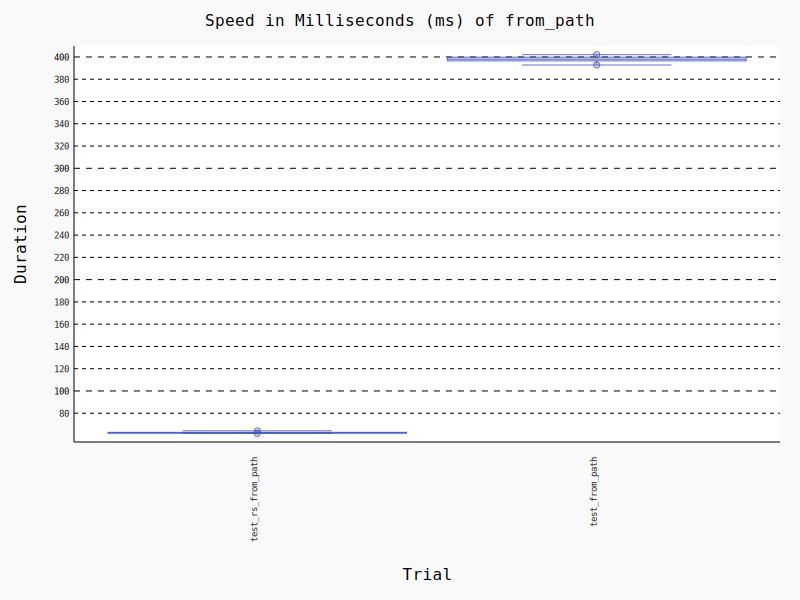

## Benchmarks
These benchmarks are intended only as a guide for the simplest scenarios.

### Test Environment
1. M1pro Mac 10core 32gb
2. Python3.10

### Test Comparison Package
1. [python-magic](https://github.com/ahupp/python-magic) v0.4.27

### Test Result:
**1. From bytes 71x performance improvement:**

**2. From path 6x performance improvement:**

